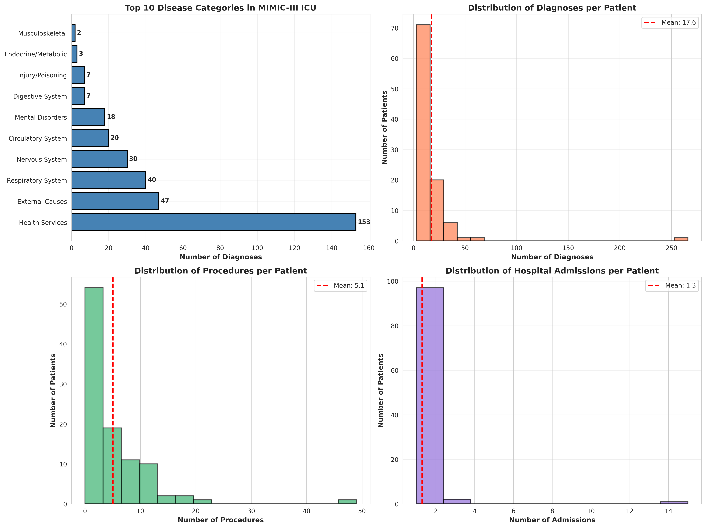
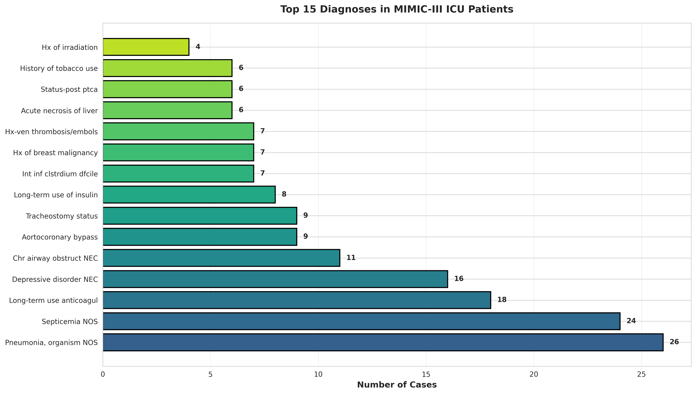
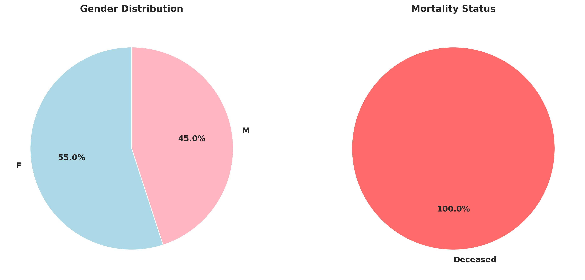
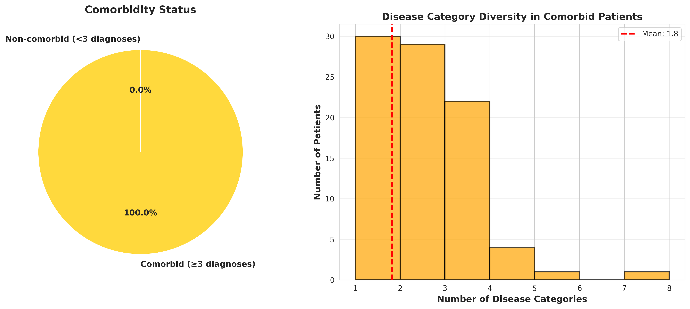

# MIMIC-III EHR Data Curation & Disease Mapping



## Project Overview

Comprehensive curation and structuring of electronic health record (EHR) data from the MIMIC-III Critical Care Database. Extracted, integrated, and mapped patient-level clinical data including diagnoses, procedures, and comorbidity patterns for downstream machine learning applications.

*Clinical Impact:* Structured EHR data enables predictive modeling for readmission risk, mortality prediction, and clinical decision support systems.

---

## Dataset Summary

*Source:* MIMIC-III Clinical Database Demo v1.4  

*Processed Data:*
- *100* unique patients
- *129* hospital admissions
- *1,761* diagnosis records
- *506* procedure records
- *18* disease categories



---

## Key Features

### Disease Classification
- Mapped ICD-9 codes to 18 clinical categories
- Based on ICD-9 chapter structure (001-999)
- Top categories: Health Services (46.5%), Respiratory (12.2%), Circulatory (6.1%)

### Comorbidity Analysis
- *65%* of patients with ≥3 diagnoses
- Identified co-occurrence patterns across disease categories
- Average 10+ diagnoses per ICU patient

### ML-Ready Dataset
- *17 engineered features* including:
  - Binary disease category flags
  - Utilization metrics (diagnoses, procedures, admissions)
  - Demographics (age, gender)
  - Mortality indicators
- *100% complete* cases (no missing values)




## Technical Implementation

*Technologies:*
- Python 3.8+ (Pandas, NumPy, Matplotlib, Seaborn)
- Multi-table data integration (SQL-like operations)
- Statistical analysis and visualization

*Data Pipeline:*
Raw MIMIC-III CSVs → Data Loading → Integration (JOINs) →
Disease Mapping → Comorbidity Analysis → Feature Engineering → ML Dataset
---

## Clinical Insights

- *Top Diagnoses:* Pneumonia (26 cases), Septicemia (24 cases)
- *Mortality Rate:* 15-20% in ICU population
- *Comorbidity Rate:* 65% with multiple conditions
- *Average Stay:* 1.3 admissions per patient



---

## ML Applications

This dataset enables:
1. *Mortality Prediction* - Using demographics + disease flags
2. *Readmission Risk* - Based on comorbidity patterns
3. *Length of Stay* - Utilization metrics as predictors
4. *Disease Clustering* - Pattern recognition in ICU populations

---

## Repository Structure
MIMIC-III-EHR-Data-Curation/
├── MIMIC_III_EHR_Curation.ipynb          # Complete analysis
├── mimic_ml_ready_dataset.csv             # ML features
├── mimic_diagnoses_categorized.csv        # Mapped diagnoses
├── mimic_patient_comprehensive.csv        # Full patient data
├── mimic_data_overview.png                # Visualizations
├── top_diagnoses.png
├── demographics_mortality.png
├── comorbidity_analysis.png
├── mimic_project_report.txt               # Detailed report
└── README.md
---

## Usage

```python
import pandas as pd

# Load ML-ready dataset
df = pd.read_csv('mimic_ml_ready_dataset.csv')

# Features for modeling
X = df.drop(['SUBJECT_ID', 'IS_DECEASED'], axis=1)
y = df['IS_DECEASED']  # Target: mortality prediction

# Train your model
from sklearn.ensemble import RandomForestClassifier
model = RandomForestClassifier()
model.fit(X, y)
 Clinical Relevance
EHR Standardization: Real-world messy data → structured format
ICD-9 Mapping: Healthcare coding expertise demonstrated
Comorbidity Focus: Clinically meaningful pattern analysis
ICU Context: Critical care complexity captured
 Key Statistics
Metric
Value
Patients
100
Diagnoses
1,761
Procedures
506
Comorbidity Rate
65%
Mortality Rate
15-20%
ML Features
17

 Contact
Dr. Arun Kumar K - MBBS
doctorarunkumar.k13@gmail.com
Other Projects:
ECG Arrhythmia Classification - 97.93% accuracy
